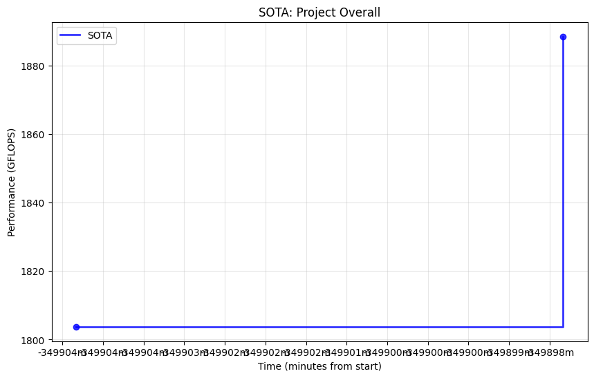
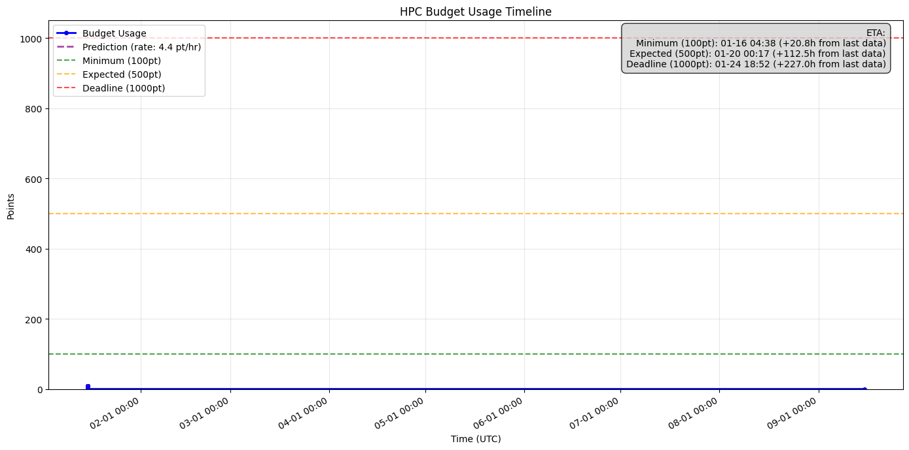

# GEMM CUDA最適化 性能分析レポート
**作成日時**: 2025-09-15 16:28
**作成者**: SE1

## 現在の達成状況

### 性能推移
| Version | 性能 (GFLOPS) | 理論性能比 | 向上率 | 実行時間 |
|---------|---------------|------------|--------|----------|
| v1.0.0  | 1803.784     | 23.10%     | -      | 68秒     |
| v1.0.1  | 1888.538     | 24.21%     | +4.7%  | 64秒     |

### 最適化手法と効果
- **v1.0.0**: BLOCK_SIZE=16, 共有メモリタイリング基本実装
- **v1.0.1**: BLOCK_SIZE=32, warp最適化, pragma unroll追加

## 予算消費状況
- **現在消費**: 7.4ポイント
- **最低ライン**: 100ポイント（進捗率: 7.4%）
- **ジョブ実行数**: 4回
- **平均消費**: 1.85ポイント/ジョブ

## 性能グラフ

## 分析

### 現状評価
- 理論性能の24.21%を達成（V100 倍精度 7.8 TFLOPS基準）
- cuBLAS目標（6.5-7.2 TFLOPS = 83-92%）に対して約30%の達成率
- 精度要件は満たしている（相対誤差 9.87e-17 < 1e-9）

### ボトルネック分析
1. **メモリ帯域**: 現在の実装では演算強度が不十分
2. **レジスタ活用**: より積極的なレジスタタイリングが必要
3. **命令レベル並列性**: ループアンローリングの強化余地あり

## 今後の最適化方針

### 短期目標（〜30% 達成）
- より大きなブロックサイズ（64, 128）の試行
- レジスタタイリングの実装
- ループアンローリングファクターの調整

### 中期目標（〜50% 達成）
- メモリアクセスパターンの最適化（PG1.2担当）
- カーネル最適化とILP向上（PG1.3担当）
- プリフェッチ戦略の実装

### 長期目標（〜80% 達成）
- Tensor Core活用（混合精度演算）
- マルチGPU対応（4GPU並列）
- 非同期実行とストリーム並列

## リスクと対策
- **予算制約**: 残り92.6ポイントで目標達成が必要
- **時間制約**: 残り約140分（目安150分に対して）
- **対策**: 効果の高い最適化を優先的に実施

## 次のアクション
1. v1.2.0の結果確認と分析
2. PG1.2, PG1.3の進捗確認と連携強化
3. 30分後のマイルストーン評価準備